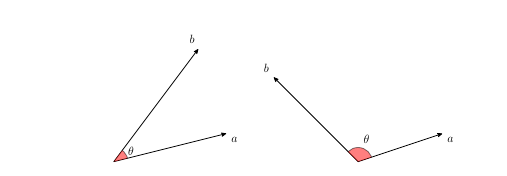

 
Some scholars argue that over the last centuries, the US constitution has emerged, either verbatim or paraphrased, in numerous founding documents across the globe. Will this trend continue, and how might one even measure constitutional influence, anyway? This exercise is in part based on David S. Law and Mila Versteeg. (2012). "The Declining Influence of the United States Constitution", *New York University Law Review* Vol. 87, No. 3, pp. 762--858, and Zachary Elkins, Tom Ginsburg, and James Melton. (2012).  "Comments on Law And Versteeg's the Declining Influence of the United States Constitution." *New York University Law Review* Vol. 87, No. 6, pp. 2088--2101 One way is to measure constitutional influence is to see which constitutional rights (such as free speech) are shared across the founding documents of different countries, and observe how this commonality changes over time. An alternative approach, which we take in this exercise, is to examine textual similarity among constitutions.  We focus on the preamble of each constitution, which typically states the guiding purpose and principles of the rest of the constitution. 

The data in the file `constitutions.csv` has the following variables:

-----------------------------------------------------------------------------
 Name                 Description
 -------------------- -------------------------------------------------------
 `country`            The country name with underscores 
 
 `year`               The year the constitution was created
 
 `preamble`           Raw text of the constitution's preamble
-----------------------------------------------------------------------------
 
## Question 1

First, let's visualize the data to better understand how constitutional documents differ. Start by importing the preamble data, tokenizing, and preprocessing the text. Calculate both the regular document term frequency and the tf-idf weighted term frequency. In both cases, visualize the preamble to the U.S. Constitution with a word cloud. How do the results differ between the two methods? 

## Question 2

We next apply the k-means algorithm to the tf-idf and identify clusters of similar constitution preambles. Set the number of clusters to 4 and describe the results. To make each row comparable, divide it by a constant such that each row represents a vector of unit length. Note that the length of a vector $a=[a_1,a_2,\dots,a_n]$ is given by $||a||=\sqrt{a_1^2+a_2^2+\dots+a_n^2}$

## Question 3

We will next see whether the U.S. Constitutional preamble became more or less similar to foreign constitutions over time. In the document-term matrix, each document is represented as a vector of frequency. To compare two documents, we define *cosine similarity* as the cosine of the angle $\theta$ between the two corresponding $n$-dimensional vectors, $a=(a_1,a_2,\dots,a_n)$ and $b=(b_1,b_2,\dots,b_n)$. Formally, the measure is defined as follows:

\begin{align}
\text{cosine similarity} &\ = \ \cos \theta \\
      &\ = \ \frac{a \cdot b}{||a||\cdot ||b||} \\
      &\ = \ \frac{\sum_{i=1}^n a_i b_i}
                 {\sqrt{\sum_{i=1}^n a_i^2} \sqrt{\sum_{i=1}^n b_i^2}}
\end{align}

The numerator represents the so-called *dot product* of *a* and *b*, while the denominator is the product of the lengths of the two vectors. The measure ranges from -1 (when the two vectors go in the opposite directions) to 1 (when they completely overlap).  

```{r, label='cosine', out.width='75%', fig.align = 'center'}

```

As illustrated in the figure, two vectors have a positive (negative) value of cosine similarity when they point in similar (different) directions.  The measure is zero when they are perpendicular to each other.

```{r}
cosine <- function(a, b) {
    ## t() transposes a matrix ensuring that vector `a' is multiplied 
    ## by each row of matrix `b'
    numer <- apply(a * t(b), 2, sum) 
    denom <- sqrt(sum(a^2)) * sqrt(apply(b^2, 1, sum))
    return(numer / denom)
}
```
  
Apply the above function to identify the five constitutions whose preambles most resemble that of the US constitution. Alternatively, you can use the `pairwise_similarity()` function from the `widyr` package. 

## Question 4

We examine the influence of US constitutions on other constitutions over time. We focus on the post-war period. Sort the constitutions chronologically and calculate, for every ten years from 1960 until 2010, the average of cosine similarity between the US constitution and the constitutions that were created during the past decade.  Plot the result. Each of these averages computed over time is called the *moving average*. Does similarity tend to increase, decrease, or remain the same over time? Comment on the pattern you observe.

## Question 5

We next construct directed, weighted network data based on the cosine similarity of constitutions. Specifically, create an adjacency matrix whose (i,j)-th entry represents the cosine similarity between the i-th and j-th constitution preambles, where the i-th constitution was created in the same year or after the j-th constitution. This entry equals zero if the i-th constitution was created before the j-th constitution. Hint: first create an edge list with a column for the relevant similarity between two constitutions. You may need to create new variables for the constitution years. After creating the graph object, you can assign weights to the edges where the weight is the cosine similarity. Apply the PageRank algorithm to this weighted adjacency matrix. Briefly comment on the result.

