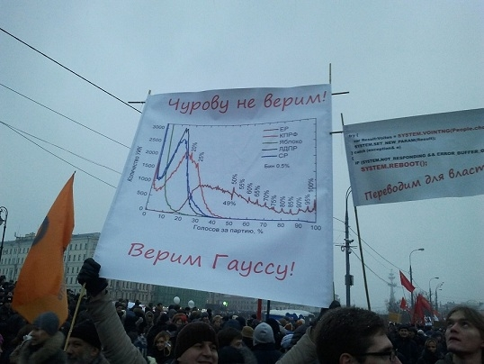

The poster says, 'We don't believe Churov! We believe Gauss!'  Churov is the head of the State Electoral Commissions and Gauss refers to a 18th century German mathematician, Carl Friedrich Gauss, whom the Gaussian (Normal) distribution was named after. Source: [http://darussophile.com/2011/12/measuring-churovs-beard/](http://darussophile.com/2011/12/measuring-churovs-beard/).

In this exercise, we use the rules of probability to detect election fraud by examining voting patterns in the 2011 Russian State Duma election. This exercise is based on Arturas Rozenas (2017) "Detecting election fraud from irregularities in vote-share distributions" *Political Analysis*, vol. 25, no. 1, pp. 41-56. The State Duma is the federal legislature of Russia. The ruling political party, United Russia, won this election, but to many accusations of election fraud, which the Kremlin or Russian government denied. As shown in figure \@(fig:russia), some protesters highlighted irregular patterns of voting as evidence of election fraud. In particular, the protesters pointed out the relatively high frequency of common fractions such as $1/4$, $1/3$, and $1/2$ in the official vote shares.

We analyze the official election results, contained in the `russia2011` data frame in the RData file `fraud.RData`, to investigate whether there is any evidence for election fraud. The .RData file can be loaded using the `load` function. 

In addition to `russia2011`, the file contains election results from the 2003 Russian Duma election `russia2003`, the 2012 Russian presidential election `russia2012`, and the 2011 Canadian election `canada2011` as separate data frames.  Each of these data sets has the same variables, described in the table below.

-------------------------------------------------------------------
 Name                Description
 ------------------- ----------------------------------------------
 `N`                 Total number of voters in a precinct 
 
 `turnout`           Total turnout in a precinct
 
 `votes`             Total number of votes for winner in a precinct
-------------------------------------------------------------------

**Note**: part of this exercise may require computationally intensive code.

The RData file `fraud.RData` contains data on four elections; the 2007 and 2011 Russian Duma elections, the 2012 Russian presidential election, and the 2011 Canadian election. Alternatively, you can load each of the data sets separately from the `qss` package. 

## Question 1

To analyze the 2011 Russian election results, first compute United Russia's vote share as a proportion of the voters who turned out. Identify the 10 most frequently occurring fractions for the vote share. Create a histogram that sets the number of bins to the number of unique fractions, with one bar created for each uniquely observed fraction, to differentiate between similar fractions like $1/2$ and $51/100$. This can be done by using the `breaks` argument in the `hist` function.  What does this histogram look like at fractions with low numerators and denominators such as $1/2$ and $2/3$?

## Question 2

The mere existence of high frequencies at low fractions may not imply election fraud. Indeed, more numbers are divisible by smaller integers like 2, 3, and 4 than by larger integers like 22, 23, and 24. To investigate the possibility that the low fractions arose by chance, assume the following probability model. The turnout for a precinct has a binomial distribution, whose size equals the number of voters and success probability equals the turnout rate for the precinct.  The vote share for United Russia in this precinct is assumed to follow the binomial distribution, conditional on the turnout, where the size equals the number of voters who turned out and the success probability equals the observed vote share in the precinct.  Conduct a Monte Carlo simulation under this alternative assumption (1,000 simulations should be sufficient). What are the 10 most frequent vote share values?  Create a histogram similar to the one in the previous question. Briefly comment on the results you obtain. **Note:** This question requires a computationally intensive code. Write code with a small number of simulations first and then run the final code with 1000 simulations.

## Question 3

To judge the Monte Carlo simulation results against the actual results of the 2011 Russian election, we compare the observed fraction of observations within a bin of certain size with its simulated counterpart. To do this, create histograms showing the distribution of Question 2's four most frequently occurring fractions, i.e., $1/2$, $1/3$, $3/5$, and $2/3$, and compare them with the corresponding fractions' proportion in the actual election. Briefly interpret the results.

## Question 4

We now compare the relative frequency of observed fractions with the simulated ones beyond the four fractions examined in the previous question. To do this, we choose a bin size of 0.01 and compute the proportion of observations that fall into each bin. We then examine whether or not the observed proportion falls within the 2.5 and 97.5 percentiles of the corresponding simulated proportions. Plot the result with the horizontal axis as the vote share and vertical axis as the estimated proportion. This plot will attempt to reproduce the one held by protesters in the figure. Also, count the number of times when the observed proportions fall outside of the corresponding range of simulated proportions. Interpret the results.

## Question 5

To put the results of the previous question in perspective, apply the procedure developed in the previous question to the 2011 Canadian elections and the 2003 Russian election, where no major voting irregularities were reported.  In addition, apply this procedure to the 2012 Russian presidential election, where election fraud allegations were reported. No plot needs to be produced. Briefly comment on the results you obtain.

Note: This question requires computationally intensive code. Write code with a small number of simulations first and then run the final code with 1000 simulations.

